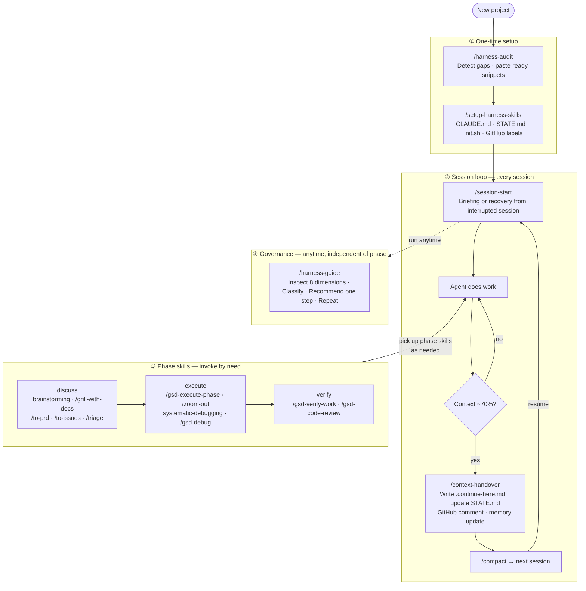

# Harness Engineering Skills

[](https://skills.sh/ClydeShen/harness-skill)

Agent skills for compound engineering workflows — structured sessions, context handover, issue lifecycle, and harness health.

---

## Why this framework exists

Anthropic's engineering team identified a hard ceiling on what long-running agents can reliably do without external scaffolding. In [*Effective Harnesses for Long-Running Agents*](https://www.anthropic.com/engineering/effective-harnesses-for-long-running-agents) (2025), they describe two failure modes that appear even with frontier models:

- **One-shot overreach** — the agent attempts to build everything at once, runs out of context mid-implementation, and the next session inherits a half-finished codebase with no record of intent.
- **Premature done declaration** — the agent sees partial progress and concludes the task is complete. No one catches it until a user or CI run reveals the gaps.

These are harness problems, not model capability problems. This framework is the operational layer that article describes, packaged as installable skills so you do not have to build it from scratch.

---

## What you get

- **Named anti-patterns** — Fuzzy Done, Proxy Signal, Confidence Exit, Planning=Done. When an agent fails, you can say which pattern it hit. ([anti-patterns.md](./skills/engineering/harness-guide/references/anti-patterns.md))
- **A session state machine** — `STATE.md` tracks phase, status, and active task. Every session starts with a briefing; every session ends with a handoff. An interrupted session leaves a detectable fingerprint.
- **Four-layer recoverable state** — Intent (STATE.md + CLAUDE.md) → Position (.continue-here.md + GitHub issue) → Evidence (git log + issue comments) → Memory (memobank/mem0/letta). Any interruption is recoverable without human intervention.
- **Glue between issue tracker, agent, and memory** — skills read from and write to GitHub Issues, `.planning/`, and the memory system as a coordinated unit.
- **A behavioral baseline** — CLAUDE.md derived from [Karpathy's observations on LLM coding pitfalls](https://x.com/karpathy/status/2015883857489522876) plus a fifth section (Harness Discipline) that enforces session boundary discipline.

---

## Sources and attribution

| Source | Role in this framework |
|---|---|
| [Effective Harnesses for Long-Running Agents](https://www.anthropic.com/engineering/effective-harnesses-for-long-running-agents) — Anthropic Engineering | Core design: initializer + coding agent + clean-state discipline |
| [Andrej Karpathy — LLM coding pitfalls](https://x.com/karpathy/status/2015883857489522876) | CLAUDE.md behavioral baseline: Think Before Coding, Simplicity First, Surgical Changes, Goal-Driven Execution |
| [mattpocock/skills](https://github.com/mattpocock/skills) | Direct source: `grill-me`, `handoff`, `zoom-out`, `caveman`, `write-a-skill`, `setup-matt-pocock-skills`, `to-prd`, `to-issues`, `triage`, `grill-with-docs` — kept verbatim, extended, or rewritten |
| [obra/superpowers](https://github.com/obra/superpowers) | Companion collection: `brainstorming`, `systematic-debugging`, `writing-plans`, `subagent-driven-development` |
| [open-gsd/get-shit-done-redux](https://github.com/open-gsd/get-shit-done-redux) | Recommended companion: discuss → plan → execute → verify phase lifecycle |

---

## Built on mattpocock/skills

Use **mattpocock/skills alone** if:
- Your agent work fits in one context window
- You do not need cross-session state recovery or structured handoffs

Use **this collection** if:
- Agent tasks run across multiple context windows or days
- You need verifiable session boundaries and interrupted-session recovery
- You want named anti-patterns and continuous harness governance
- You are coordinating agent work with a GitHub issue tracker

Five skills in this collection have no equivalent in mattpocock — they are the harness layer the Anthropic article describes but does not supply as ready-to-use tools:

| Skill | What it adds |
|---|---|
| `/harness-audit` | Scans for harness gaps, outputs prioritised list with paste-ready snippets. Never writes files. Stop hook is always gap #1. |
| `/harness-guide` | Continuous coaching loop: inspect → classify → recommend one next step → repeat. Detects anti-patterns by name. |
| `/session-start` | Reads STATE.md and `.continue-here.md`. Outputs structured briefing or recovery brief when an interrupted session is detected. |
| `/context-handover` | Session boundary manager: writes `.continue-here.md`, updates STATE.md, posts GitHub progress comment, updates memory system. |
| `/skill-cleanup` | Audits installed skills across all agent platforms for stale or duplicate entries. Interactive, dry-run mode, never deletes without confirmation. |

---

## Skill lifecycle



*Phase skills (③) from [mattpocock/skills](https://github.com/mattpocock/skills) · [obra/superpowers](https://github.com/obra/superpowers) · [open-gsd/get-shit-done-redux](https://github.com/open-gsd/get-shit-done-redux) · Harness design from [Anthropic 2025](https://www.anthropic.com/engineering/effective-harnesses-for-long-running-agents)*

---

## Use cases

### New project — detect gaps and configure once

```
/harness-audit
```

Outputs a prioritised gap list with paste-ready snippets. Typical first run:

```
1. Missing Stop hook         → paste .claude/settings.json snippet
2. No instruction file       → paste CLAUDE.md template
3. No memory system          → install memobank or equivalent
4. CI runs build only        → paste .github/workflows/ci.yml snippet
```

Close gap #1 first. Nothing else matters until the agent cannot declare done without running a verification. Then:

```
/setup-harness-skills
```

One-time interactive setup: writes `CLAUDE.md`, creates GitHub labels, initialises `.planning/STATE.md`. Shows a draft before writing anything.

### Sustained multi-day feature work

Every session starts with:

```
/session-start
```

Output on a clean resume:

```
Phase: execute
Active task: #12 — Add payment webhook handler
Effort remaining: ~2 context windows
Pick up from: implement idempotency key check in webhook.ts:handleEvent()
```

Output when the previous session was interrupted without `/context-handover`:

```
⚠️ Recovery briefing — interrupted session detected
Last session started: 2026-05-27T14:32:00Z — no handover recorded.

git log since interruption:
  a3f91c2 feat: add webhook signature verification
  (no further commits)

Resume from last commit. Run lint+build before continuing.
```

When context reaches ~70%, run `/context-handover`. It writes `.continue-here.md`, updates STATE.md, and posts a GitHub progress comment. Then run `/compact`. The next session picks up exactly at `<next_action>`.

### Harness drift — ongoing governance

After weeks of work, `CLAUDE.md` has grown past 200 lines, the Stop hook was removed during a config refactor, CI no longer runs lint.

```
/harness-guide
```

Inspects 8 dimensions, classifies every finding into three buckets (✅ aligned / ⚠️ weak / ❌ missing), and recommends exactly one next step. The coaching loop continues after you act on each recommendation.

---

## Quickstart

Install `harness-audit` only (recommended first step in any project):

```bash
npx skills add ClydeShen/harness-skill@harness-audit -g
```

Open your project in Claude Code and run:

```
/harness-audit
```

## Full collection (all 15 skills)

Add to `~/.claude/settings.json`:

```json
{
  "plugins": [
    { "type": "git", "url": "https://github.com/ClydeShen/harness-skill" }
  ]
}
```

Or clone and symlink locally:

```bash
bash scripts/link-skills.sh
```

## Recommended companion collections

| Collection | Adds |
|---|---|
| [GSD Redux](https://github.com/open-gsd/get-shit-done-redux) | `gsd-*` skills: full discuss → plan → execute → verify phase lifecycle |
| [Superpowers](https://github.com/obra/superpowers) | `brainstorming`, `systematic-debugging`, `writing-plans`, `subagent-driven-development` |

---

## Skill reference

### Engineering

| Skill | Purpose |
|---|---|
| [harness-audit](./skills/engineering/harness-audit/SKILL.md) | Detect agent-harness gaps and output paste-ready fix snippets |
| [setup-harness-skills](./skills/engineering/setup-harness-skills/SKILL.md) | One-time project setup: CLAUDE.md, GitHub labels, `.planning/` state structure |
| [session-start](./skills/engineering/session-start/SKILL.md) | Phase detection, interrupted-session recovery, session briefing |
| [context-handover](./skills/engineering/context-handover/SKILL.md) | End-of-context-window session transition; preserves state across sessions |
| [to-prd](./skills/engineering/to-prd/SKILL.md) | Turn a conversation into a PRD with technical constraints |
| [to-issues](./skills/engineering/to-issues/SKILL.md) | Break a PRD into vertical-slice GitHub issues with AFK/HITL labels |
| [triage](./skills/engineering/triage/SKILL.md) | Issue triage state machine: classify, label, and route incoming issues |
| [grill-with-docs](./skills/engineering/grill-with-docs/SKILL.md) | Interview relentlessly against reference docs; updates `CONTEXT.md` and ADRs inline |
| [zoom-out](./skills/engineering/zoom-out/SKILL.md) | Higher-level architectural perspective on an unfamiliar section of code |
| [harness-guide](./skills/engineering/harness-guide/SKILL.md) | Continuously guide a project toward better Harness and Compound Engineering practices |

### Productivity

| Skill | Purpose |
|---|---|
| [caveman](./skills/productivity/caveman/SKILL.md) | Ultra-compressed communication mode; cuts token usage while keeping technical accuracy |
| [grill-me](./skills/productivity/grill-me/SKILL.md) | Relentless sequential interview that stress-tests a plan until every decision branch is resolved |
| [handoff](./skills/productivity/handoff/SKILL.md) | Compact the current conversation into a handoff document for another agent to continue |
| [write-a-skill](./skills/productivity/write-a-skill/SKILL.md) | Create new skills with proper structure, progressive disclosure, and bundled resources |
| [skill-cleanup](./skills/productivity/skill-cleanup/SKILL.md) | Scan installed skills, detect stale or renamed entries, guide safe removal with confirmation |
