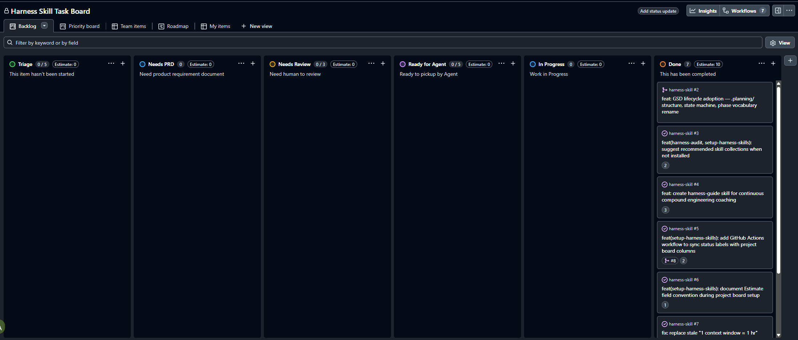
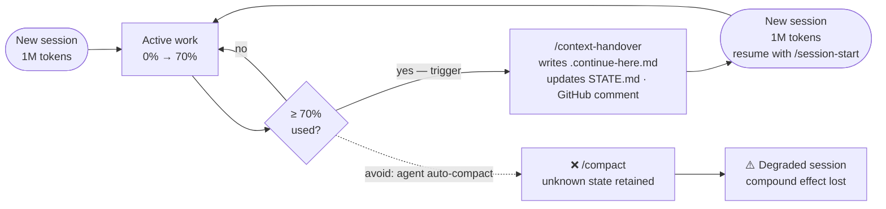
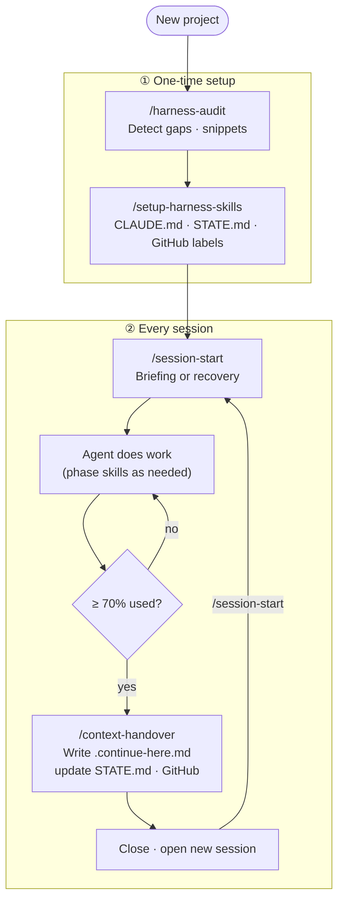
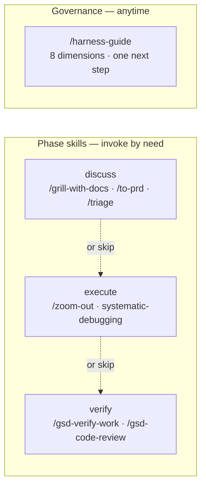

# Harness Engineering Skills

[](https://skills.sh/ClydeShen/harness-skill)

Agent skills for compound engineering workflows — structured sessions, context handover, issue lifecycle, and harness health.

---

## Why this framework exists

Anthropic's engineering team identified a hard ceiling on what long-running agents can reliably do without external scaffolding. In [*Effective Harnesses for Long-Running Agents*](https://www.anthropic.com/engineering/effective-harnesses-for-long-running-agents) (2025), they describe two failure modes that appear even with frontier models:

- **One-shot overreach** — the agent attempts to build everything at once, runs out of context mid-implementation, and the next session inherits a half-finished codebase with no record of intent.
- **Premature done declaration** — the agent sees partial progress and concludes the task is complete. No one catches it until a user or CI run reveals the gaps.

These are harness problems, not model capability problems. This framework is the operational layer that article describes, packaged as installable skills so you do not have to build it from scratch.

---

## What you get

- **Named anti-patterns** — Fuzzy Done, Proxy Signal, Confidence Exit, Planning=Done. When an agent fails, you can say which pattern it hit. ([anti-patterns.md](./skills/engineering/harness-guide/references/anti-patterns.md))
- **A session state machine** — `STATE.md` tracks phase, status, and active task. Every session starts with a briefing; every session ends with a handoff. An interrupted session leaves a detectable fingerprint.
- **Four-layer recoverable state** — Intent (STATE.md + CLAUDE.md) → Position (.continue-here.md + GitHub issue) → Evidence (git log + issue comments) → Memory (memobank/mem0/letta). Any interruption is recoverable without human intervention.
- **Glue between issue tracker, agent, and memory** — skills read from and write to GitHub Issues, `.planning/`, and the memory system as a coordinated unit.
- **A behavioral baseline** — CLAUDE.md derived from [Karpathy's observations on LLM coding pitfalls](https://x.com/karpathy/status/2015883857489522876) plus a fifth section (Harness Discipline) that enforces session boundary discipline.

---

## Built on mattpocock/skills

Use **mattpocock/skills alone** if:
- Your agent work fits in one context window
- You do not need cross-session state recovery or structured handoffs

Use **this collection** if:
- Agent tasks run across multiple context windows or days
- You need verifiable session boundaries and interrupted-session recovery
- You want named anti-patterns and continuous harness governance
- You are coordinating agent work with a GitHub issue tracker

Five skills in this collection have no equivalent in mattpocock — they are the harness layer the Anthropic article describes but does not supply as ready-to-use tools:

| Skill | What it adds |
|---|---|
| `/harness-audit` | Scans for harness gaps, outputs prioritised list with paste-ready snippets. Never writes files. Stop hook is always gap #1. |
| `/harness-guide` | Continuous coaching loop: inspect → classify → recommend one next step → repeat. Detects anti-patterns by name. |
| `/session-start` | Reads STATE.md and `.continue-here.md`. Outputs structured briefing or recovery brief when an interrupted session is detected. |
| `/context-handover` | Session boundary manager: writes `.continue-here.md`, updates STATE.md, posts GitHub progress comment, updates memory system. |
| `/skill-cleanup` | Audits installed skills across all agent platforms for stale or duplicate entries. Interactive, dry-run mode, never deletes without confirmation. |

---

## GitHub as the agent's operating system

No external project management tool required. The framework uses GitHub Issues and GitHub Project Kanban natively — the same APIs available to every repo — as the agent's task queue and state machine.



A GitHub Action (`sync-status.yml`) keeps the board in sync automatically — no webhooks, no third-party service, no extra dependencies:

- A `status:*` label applied to any issue → board column updates instantly
- PR opened against an issue → issue moves to **In Progress**
- PR merged → linked issue closes and moves to **Done**

The agent reads `status:ready-for-agent` issues to know what to work on next. When it finishes, it applies `status:done`. The board reflects live project state without any manual moves.

| Column | Who moves it | Meaning |
|---|---|---|
| Triage | Agent | New issue, needs classification |
| Needs PRD | Agent | Story not writable yet — requirements missing |
| Needs Review | Agent | Human must validate before agent starts (HITL) |
| Ready for Agent | Human or Agent | Agent confident — can start autonomously (AFK) |
| In Progress | GitHub Action | PR opened against this issue |
| Done | GitHub Action | PR merged |

---

## Context window discipline

Compound engineering works like compound interest: each session should make subsequent sessions more effective, not harder. ([Compound Engineering with AI](https://ai.sulat.com/compound-engineering-with-ai-the-definitive-guide-05530cf717dd)) The mechanism that enables this is **context window discipline** — keeping each session clean, bounded, and explicitly handed off.

A Claude Code session opens with 1 million tokens. Task size is measured in **context windows**, not hours or days. When sessions overflow, bleed into each other through `/compact`, or take on tasks too large to hand off cleanly, the compounding effect degrades: context pollution accumulates, drift builds across transfers, and the original intent becomes unrecoverable. ([Effective Context Engineering for AI Agents](https://www.anthropic.com/engineering/effective-context-engineering-for-ai-agents))



### Effort estimate (unit: context windows)

Every GitHub issue carries an `Effort` field — the number of context windows estimated to complete it:

- `1` = fits in one session

```
Effort = 3 CW example:

CW 1  [████████████████████████████░░░░░░░]  → /context-handover
CW 2  [████████████████████████████░░░░░░░]  → /context-handover
CW 3  [████████████░░░░░░░░░░░░░░░░░░░░░░░]  → done ✓
       ←── active work (70%) ──→ ←─ buffer ─→
```

- Maximum: **8 context windows**. Any issue estimated above this must be split into smaller tasks before the agent starts. Beyond 8, handoff drift compounds: each session-to-session transfer carries a small loss of precision, and enough transfers make the original intent unrecoverable. ([Effective Harnesses for Long-Running Agents](https://www.anthropic.com/engineering/effective-harnesses-for-long-running-agents))

The `/to-issues` skill enforces this ceiling at creation time. An issue scoped above 8 CW cannot be created — the agent must break it down first.

### Session boundary: trigger at 70%, not later

```
  0%                                         70%            100%
  [████████████████████████████████████████░░░░░░░░░░░░░░░░░░░]
   ←─────────────── active work ────────────→ ←── buffer ────→
```

The agent monitors token usage after every tool call. At the system-configured threshold (≥70% of the context window):

1. Run `/context-handover` — writes `.continue-here.md`, updates STATE.md, posts a GitHub progress comment
2. Close the current Claude Code session
3. Open a **new** Claude Code session
4. Run `/session-start` — reads the handoff artifact and resumes exactly at `<next_action>`

The remaining 30% is the buffer for executing the handover itself. Triggering late leaves insufficient budget for a clean handoff. ([Effective Context Engineering for AI Agents](https://www.anthropic.com/engineering/effective-context-engineering-for-ai-agents))

### Do not let the agent auto-run `/compact`

`/compact` compresses conversation history, but neither you nor the agent knows exactly what was retained. Critical context — constraints established earlier in the session, in-progress decisions, partial implementation state — can silently disappear. The session continues in a degraded, unverifiable state.

`/context-handover` + new session is the correct alternative. The handoff artifact (`.continue-here.md`) is explicit, human-readable, and fully recoverable by any fresh agent with no prior context. Each new session starts with a full 1M token budget and a clean context — the compound effect is preserved, not diluted.

---

## Skill lifecycle



*Run `/harness-guide` anytime for governance — inspects 8 dimensions, recommends one next step. Phase skills (discuss / execute / verify) shown in the [Use cases](#use-cases) section below. Harness design from [Anthropic 2025](https://www.anthropic.com/engineering/effective-harnesses-for-long-running-agents)*

---

## Use cases



### New project — detect gaps and configure once

```
/harness-audit
```

Outputs a prioritised gap list with paste-ready snippets. Typical first run:

```
1. Missing Stop hook         → paste .claude/settings.json snippet
2. No instruction file       → paste CLAUDE.md template
3. No memory system          → install memobank or equivalent
4. CI runs build only        → paste .github/workflows/ci.yml snippet
```

Close gap #1 first. Nothing else matters until the agent cannot declare done without running a verification. Then:

```
/setup-harness-skills
```

One-time interactive setup: writes `CLAUDE.md`, creates GitHub labels, initialises `.planning/STATE.md`. Shows a draft before writing anything.

### Sustained multi-day feature work

Every session starts with:

```
/session-start
```

Output on a clean resume:

```
Phase: execute
Active task: #12 — Add payment webhook handler
Effort remaining: ~2 context windows
Pick up from: implement idempotency key check in webhook.ts:handleEvent()
```

Output when the previous session was interrupted without `/context-handover`:

```
⚠️ Recovery briefing — interrupted session detected
Last session started: 2026-05-27T14:32:00Z — no handover recorded.

git log since interruption:
  a3f91c2 feat: add webhook signature verification
  (no further commits)

Resume from last commit. Run lint+build before continuing.
```

At ~70%, follow the [session boundary protocol](#session-boundary-trigger-at-70-not-later) — `/context-handover` → close → new session → `/session-start`.

### Harness drift — ongoing governance

After weeks of work, `CLAUDE.md` has grown past 200 lines, the Stop hook was removed during a config refactor, CI no longer runs lint.

```
/harness-guide
```

Inspects 8 dimensions, classifies every finding into three buckets (✅ aligned / ⚠️ weak / ❌ missing), and recommends exactly one next step. The coaching loop continues after you act on each recommendation.

---

## Quickstart

Install `harness-audit` only (recommended first step in any project):

```bash
npx skills add ClydeShen/harness-skill@harness-audit -g
```

Open your project in Claude Code and run:

```
/harness-audit
```

## Full collection (all 15 skills)

Add to `~/.claude/settings.json`:

```json
{
  "plugins": [
    { "type": "git", "url": "https://github.com/ClydeShen/harness-skill" }
  ]
}
```

Or clone and symlink locally:

```bash
bash scripts/link-skills.sh
```

## Recommended companion collections

| Collection | Adds |
|---|---|
| [GSD Redux](https://github.com/open-gsd/get-shit-done-redux) | `gsd-*` skills: full discuss → plan → execute → verify phase lifecycle |
| [Superpowers](https://github.com/obra/superpowers) | `brainstorming`, `systematic-debugging`, `writing-plans`, `subagent-driven-development` |

---

## Sources and attribution

| Source | Role in this framework |
|---|---|
| [Effective Harnesses for Long-Running Agents](https://www.anthropic.com/engineering/effective-harnesses-for-long-running-agents) — Anthropic Engineering | Core design: initializer + coding agent + clean-state discipline |
| [Effective Context Engineering for AI Agents](https://www.anthropic.com/engineering/effective-context-engineering-for-ai-agents) — Anthropic Engineering | Context as a finite, depletable resource; compaction strategy; structured note-taking across sessions |
| [Compound Engineering with AI — The Definitive Guide](https://ai.sulat.com/compound-engineering-with-ai-the-definitive-guide-05530cf717dd) | Compound of time: each session makes subsequent sessions more effective; 40/10/40/10 cycle (Plan/Work/Review/Compound) |
| [Andrej Karpathy — LLM coding pitfalls](https://x.com/karpathy/status/2015883857489522876) | CLAUDE.md behavioral baseline: Think Before Coding, Simplicity First, Surgical Changes, Goal-Driven Execution |
| [mattpocock/skills](https://github.com/mattpocock/skills) | Direct source: `grill-me`, `handoff`, `zoom-out`, `caveman`, `write-a-skill`, `setup-matt-pocock-skills`, `to-prd`, `to-issues`, `triage`, `grill-with-docs` — kept verbatim, extended, or rewritten |
| [obra/superpowers](https://github.com/obra/superpowers) | Companion collection: `brainstorming`, `systematic-debugging`, `writing-plans`, `subagent-driven-development` |
| [open-gsd/get-shit-done-redux](https://github.com/open-gsd/get-shit-done-redux) | Recommended companion: discuss → plan → execute → verify phase lifecycle |
